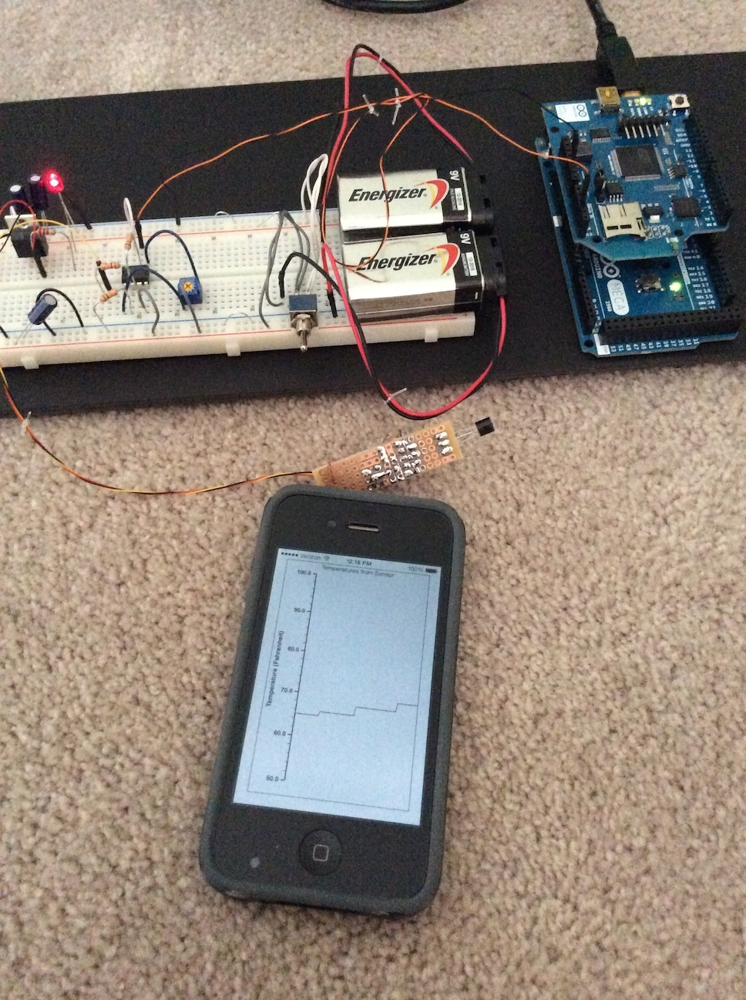

#Overview
This system reads a temperature via temperature sensor that is connected to an Arduino.  The temperature is sent to a web application via Wi-Fi on the Arduino.  An iOS app pulls the data from the web application via JSON API and the temperatures are plotted on a graph.

#The Setup

#Requirements for Arduino
1. Arduino (using Mega 2560)
2. Arduino Wi-Fi Shield

#Requirements for Web Application
1. Node.js + Express web application framework
2. MongoDB (database)

#Requirements for iOS Application
1. Core Plot for iOS (https://github.com/core-plot/core-plot/wiki)

#Components of This Example
1. Code for Arduino: `wifi_send_data`
2. The web application: `temperatureweb`
3. iOS application: `TemperatureGraphApp-iOS`
